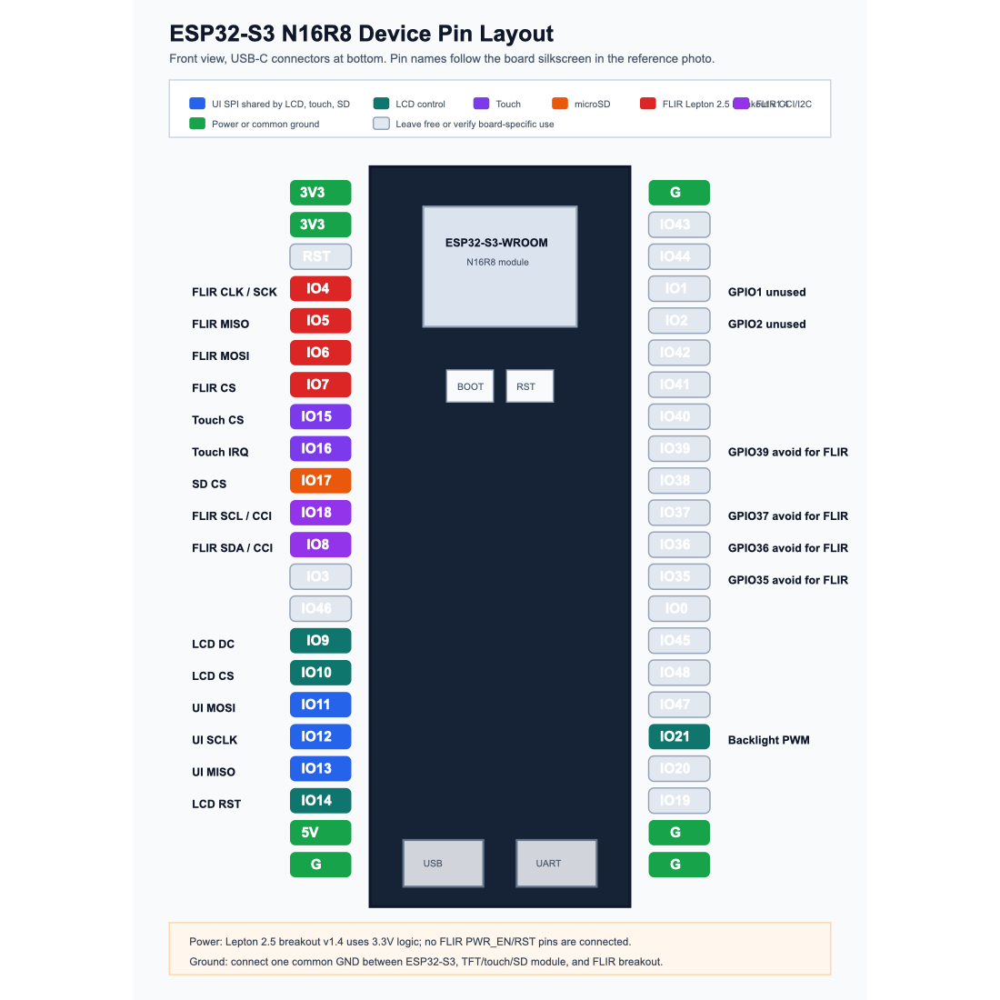

# GPIO Pin Map

This is a proposed safe starting map for a generic ESP32-S3 development board.
Verify the exact board schematic before wiring. Some ESP32-S3 boards do not
expose every GPIO, and some pins may be connected to onboard flash, PSRAM, RGB
LEDs, buttons, USB, or UART.

The diagram above maps the devices onto the dual-USB ESP32-S3-WROOM N16R8
header layout shown in the reference photo. The important design choice remains:
keep the UI devices on one shared SPI bus and keep the FLIR Lepton VoSPI capture
on a dedicated SPI bus. That separation reduces the chance that display or SD
card transactions disturb Lepton packet timing.

The editable source is
[`esp32-s3-n16r8-device-pin-layout.svg`](assets/esp32-s3-n16r8-device-pin-layout.svg);
the PNG version is embedded so repository previews render consistently.

## Board Header Placement

Viewed from the front with the USB-C connectors at the bottom, this mapping
keeps the display/touch/SD wiring and FLIR Lepton 2.5 breakout wiring mostly on
the left header. The right-header `GPIO35` through `GPIO39` pins are deliberately
avoided for FLIR VoSPI on this N16R8 board.

| Header area | Device signals |
|---|---|
| Left header `GPIO11`, `GPIO12`, `GPIO13` | Shared UI SPI MOSI, SCLK, MISO. |
| Left header `GPIO9`, `GPIO10`, `GPIO14`, `GPIO15`, `GPIO16`, `GPIO17` | LCD, touch, and SD chip-select/control pins. |
| Left header `GPIO4`, `GPIO5`, `GPIO6`, `GPIO7` | Dedicated FLIR VoSPI SCLK, MISO, MOSI, CS. |
| Left header `GPIO8`, `GPIO18` | FLIR CCI/I2C SDA and SCL. |
| Power rails | Use `3V3` for FLIR, module-rated `3V3` or `5V` for TFT VCC, and common `G` ground. |

## Avoided Pins

Avoid these pins unless the board schematic says they are safe:

- `GPIO0`: boot/download strapping button on many boards.
- `GPIO3`, `GPIO45`, `GPIO46`: strapping-related pins on ESP32-S3.
- `GPIO19`, `GPIO20`: commonly used for native USB D-/D+.
- `GPIO43`, `GPIO44`: commonly used for UART logging/programming.
- `GPIO38`, `GPIO40`, `GPIO41`, `GPIO42`, `GPIO48`: commonly used for onboard
  LEDs, JTAG, or board-specific functions on ESP32-S3 N16R8 dev boards.
- Any board-specific flash/PSRAM pins.

## Proposed Bus Summary

| Function | ESP32-S3 GPIO | Notes |
|---|---:|---|
| UI SPI SCLK | `GPIO12` | Shared by LCD, touch, and SD. |
| UI SPI MOSI | `GPIO11` | Shared by LCD, touch, and SD. |
| UI SPI MISO | `GPIO13` | Required for touch and SD; optional for LCD readback. |
| FLIR SPI SCLK | `GPIO4` | Dedicated Lepton VoSPI clock. |
| FLIR SPI MISO | `GPIO5` | Lepton VoSPI data into ESP32-S3. |
| FLIR SPI MOSI | `GPIO6` | Dedicated Lepton SPI MOSI connection. |
| FLIR SPI CS | `GPIO7` | Dedicated Lepton chip-select. |
| FLIR I2C SDA | `GPIO8` | CCI/control bus. |
| FLIR I2C SCL | `GPIO18` | CCI/control bus. |

## Display, Touch, And SD Wiring

Assumed display module: 2.8 inch 240x320 SPI TFT with ILI9341 LCD, XPT2046
touch, and microSD support.

| Module signal | ESP32-S3 GPIO | Direction | Notes |
|---|---:|---|---|
| VCC | 3.3V or module-supported 5V | Power | Prefer 3.3V if supported. Use 5V only if the display module explicitly supports it. |
| GND | GND | Power | Common ground with ESP32-S3 and FLIR. |
| LCD SCK / T_CLK / SD_SCK | `GPIO12` | ESP32-S3 to module | Shared UI SPI clock. |
| LCD SDI / T_DIN / SD_MOSI | `GPIO11` | ESP32-S3 to module | Shared UI SPI MOSI. |
| LCD SDO / T_DO / SD_MISO | `GPIO13` | Module to ESP32-S3 | Shared UI SPI MISO. |
| LCD CS | `GPIO10` | ESP32-S3 to LCD | LCD chip-select. |
| LCD DC / RS | `GPIO9` | ESP32-S3 to LCD | Data/command select. |
| LCD RESET | `GPIO14` | ESP32-S3 to LCD | LCD reset. Can be tied to ESP32 reset if pins are scarce. |
| LCD LED / BL | `GPIO21` | ESP32-S3 to display | PWM backlight control if module supports GPIO-level backlight control. |
| Touch T_CS | `GPIO15` | ESP32-S3 to touch | XPT2046 chip-select. |
| Touch T_IRQ | `GPIO16` | Touch to ESP32-S3 | Optional touch interrupt; can poll if not wired. |
| SD CS | `GPIO17` | ESP32-S3 to SD | microSD chip-select. |

## FLIR Lepton 2.5 Breakout v1.4 Wiring

This project now assumes a FLIR Lepton 2.5 on breakout board v1.4. That
breakout exposes SPI/VoSPI and I2C/CCI at 3.3V logic, but it does **not**
provide separate `PWR_EN` or `RST` pins to wire to the ESP32-S3.

Important naming note: many FLIR Lepton breakout boards label the video SPI
clock as `CLK` instead of `SCK` or `SCLK`. That `CLK` pin is **not** the same as
I2C `SCL`. Use `GPIO4` for the breakout `CLK` pin, and use `GPIO18` only for
the I2C/CCI `SCL` pin.

| FLIR breakout signal | ESP32-S3 GPIO | Direction | Notes |
|---|---:|---|---|
| VIN / VCC | 3.3V | Power | Confirm breakout voltage requirements. |
| GND | GND | Power | Common ground. |
| CLK / SPI SCK / SCLK | `GPIO4` | ESP32-S3 to FLIR | Dedicated VoSPI video clock. This is the breakout `CLK` pin. |
| SPI MISO / VoSPI data | `GPIO5` | FLIR to ESP32-S3 | Thermal packet stream. |
| SPI MOSI | `GPIO6` | ESP32-S3 to FLIR | Dedicated Lepton SPI MOSI connection. |
| SPI CS | `GPIO7` | ESP32-S3 to FLIR | Dedicated chip-select. |
| SDA / CCI SDA | `GPIO8` | Bidirectional | I2C/CCI data, use pullups if breakout lacks them. |
| SCL / CCI SCL | `GPIO18` | ESP32-S3 to FLIR | I2C/CCI clock, use pullups if breakout lacks them. |
| RESET / RST / EN | Not connected | - | Breakout v1.4 does not expose this pin. |
| PWR_EN | Not connected | - | Breakout v1.4 does not expose this pin. |

Quick breakout-label mapping:

| If your FLIR breakout says... | Connect to ESP32-S3 |
|---|---:|
| `CLK` | `GPIO4` |
| `SCL` | `GPIO18` |
| `SDA` | `GPIO8` |
| `MISO` / `DATA` / `VoSPI` | `GPIO5` |
| `MOSI` | `GPIO6` |
| `CS` | `GPIO7` |

## Alternate Pin Strategy

The earlier `GPIO35` through `GPIO39` idea is avoided because those pins can be
associated with FSPI/sub-SPI functions on ESP32-S3 N16R8 boards and may interfere
with flash/PSRAM or boot stability when an external module drives them. Keep the
same bus separation if you choose another pin group. ESP32-S3 can route SPI
signals through the GPIO matrix, but high-speed Lepton capture is more sensitive
than the LCD UI bus. Prioritize short wiring and stable pins for:

1. FLIR `SCK`
2. FLIR `MISO`
3. FLIR `CS`
4. FLIR I2C `SDA/SCL`
